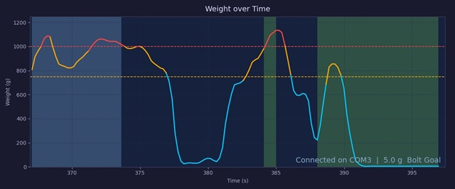
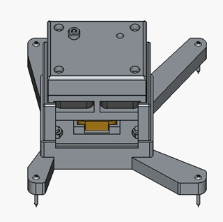
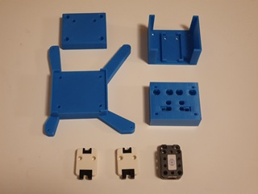
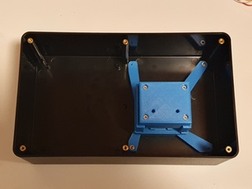
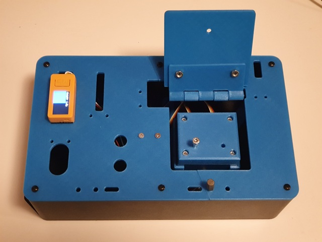
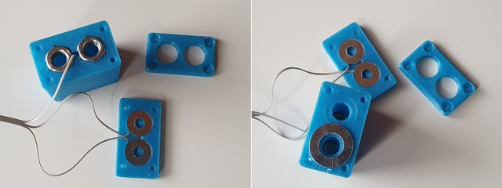

# Bolt Task Addon for Task Board TBv2023

This repository contains the Bolt Task Addon for Task Board version 2023 found in [https://github.com/peterso/robotlearningblock](https://github.com/peterso/robotlearningblock).

The Bolt Task requires the robot to unscrew a bolt, move it to another position and screw it again. During the operation the robot must not exceed predefined pressure force over the bolt task assembly.

## Introduction

Two different protopyes of the task addon are developed:
- **Type A**
   
   The presence of the bolt is detected by two [M5Stack Unit 180](https://docs.m5stack.com/en/unit/OP180).
   
   Video demonstration of the first Type A prototype and the task performed by a human can be found in the following video [https://youtu.be/7AfbINjLBa4](https://youtu.be/7AfbINjLBa4):

   

- **Type B**

   The presence of the bolt is detected by simple circuit connection similar to the connection of the terminal block of TBv2023 for PbHub port 3 as decribed in the original [peterso/robotlearningblock/Assembly of Task Board 2023_V2.pdf](https://drive.google.com/file/d/1LZS_wPafdJOO1Q0lu-8TDO9xGrxpoSBB/view?usp=sharing).

   The Type B design is more compact and might be used together wih the terminal block if more digital pins are available or second hub is added. This design checks whether the bolt is fully tightened. After the bolt is slightly loose there will be no signal on the digital pins. The robot will need to do 3 full turns to release the bolt.

   Video demonstration of the first Type B prototype and the task performed by a human can be found in the following video [https://youtu.be/U2pmAaK7oM4](https://youtu.be/U2pmAaK7oM4):

   

## Force measurement

For both designs the force is measured by one [M5Stack Unit Mini Scales (SKU:U177)](https://docs.m5stack.com/en/unit/Unit-Mini%20Scales).

Sample graphing of the force on the scales unit during operation when Type B design is used is shown in the following figure:

Video demonstration of the measured force when Type B design is used is shown in the following video [https://youtu.be/ekPisNhrMn4](https://youtu.be/ekPisNhrMn4):

## Firmware

The used controller is [M5StickC-Plus2](https://docs.m5stack.com/en/core/M5StickC%20PLUS2). On the display visual feedback is provided. When the bolt is in the start position and at least 12 bolt revolutions are executed the top (left) part of the screen is blue. When the bolt is in the end position and at least 12 bolt revolutions are executed the bottom (right) part of the screen is green. When the pressure is near the max limit the screen will turn yellow. When the pressure is over the limit the screen will turn red. The Arduino test code of the first prototype for:
- **Type A** is in the folder [./M5StickCPlus2-Arduino/BoltTaskTestTypeA/](./M5StickCPlus2-Arduino/BoltTaskTestTypeA/).

- **Type B** is in the folder [./M5StickCPlus2-Arduino/BoltTaskTestTypeB/](./M5StickCPlus2-Arduino/BoltTaskTestTypeB/).

- **Type B with force graphing** firmware is in the folder [./M5StickCPlus2-Arduino/GraphingTestTypeB/](./M5StickCPlus2-Arduino/GraphingTestTypeB/). By pressing the M5 button you can toggle the graphing display. This firmware is also sending the data via serial communication. [./M5StickCPlus2-Arduino/GraphicsTestTypeB/live_graph.py](./M5StickCPlus2-Arduino/GraphingTestTypeB/live_graph.py) is a Python script for visualization of the data. Read the comments in the beggining of the file for information about the usage.

## CAD

The Bolt Task Addon can be 3D Printed. The STLs of the parts are in the folder [./STLs/](./STLs/).

The repository contains the FreeCAD ([https://www.freecad.org/](https://www.freecad.org/)) design file for the diferrent designs:

- **Type A**

   The design file is [/CAD/BoltTaskAssembly_TypeA_V1.FCStd](/CAD/BoltTaskAssembly_TypeA_V1.FCStd).

   The Type A CAD assembly of the Bolt Task Addon is shown in the following image:

   

   The printed parts and the M5 Unit sensors are shown in the following image:

   

   The complete assembly mounted on the CU-3286-MB box is shown in the following image:

   

   Place two M4 nuts between the main and the top part to be used for bolt threads as shown in the image:

   

   The Bolt Task Addon Type A with the cover of the TBv2023 is shown in the following image:
   
   

- **Type B**

   The design file is [/CAD/BoltTaskAssembly_TypeB_V1.FCStd](/CAD/BoltTaskAssembly_TypeB_V1.FCStd).

   The Type A CAD assembly of the Bolt Task Addon is shown in the following image:

   

   For this design we are using M8x40mm bolt. The used washers are one with InnerD=10.50mm, OuterD=19.80mm, Thickness=1.77mm and two InnerD=5.30mm, OuterD=14.85mm, Thickness=1.18mm. The printed parts, the M5 Mini Scales and the used hardware are shown in the following image:

   

   The washers and the M8 nuts must be placed together with the cable going to port 3 of the PbHub as shown in the following image. The black cable must be connected to the top (the bigger) washer, the white cable is to be connected to the small washer which is below the nut ot the bolt start position and the yellow cable is to be connected to the nut below the bolt goal position. The cables must be positioned carefully so that they are not pinched by the washers when the bolt is tightened. The black cable must be routed through the hole in the main block.

   

   After the cables are routed then the three parts are assembled together with 8 M3 screws. Depending on the washers and the 3D print quality you might need to add one additional M3 or M4 washer between the M8 nut and the bottom washer. The M8 nut must touch the bottom washer to close the circuit with the M8 bolt. Further versions might use separate bottom caps to address this issue.

   The M5 Unit Mini Scales is attached to the base with two M4 screws. The bolt assembly is then snapped in to place on top of the base assembly. Currently, the scale is not attached with bolts to the bolt assembly. Then, the assembly is attached to the bottom bracket with 4 M4 screws and the complete assembly is mounted on the CU-3286-MB box as shown in the following image:

   

   The Bolt Task Addon Type B with the cover of the TBv2023 is shown in the following image:

   
