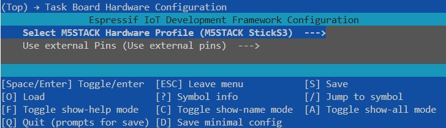

# Task Board v2023 with Bolt Task Addon IDF Firmware

The original IDF firmware can be found here: [https://github.com/peterso/robotlearningblock/tree/main/idf/taskboard](https://github.com/peterso/robotlearningblock/tree/main/idf/taskboard).

The files in the patch directory provide an easy way to extend thi original firmware and to add support for the newer M5Stack StickS3 board and for the developed Bolt Task Addon.

You can compile and flash the board with the new firmware as follows:

1. Clone the original IDF firmware and patch it with the updated code:
    ```bash
    git clone https://github.com/kyovchev/robotlearningblock
    cd robotlearningblock
    git submodule update --init --recursive
    cd idf/taskboard/
    rm -rf components/m5stack__m5unified/
    rm sdkconfig sdkconfig.old dependencies.lock
    sudo rm -rf build
    sudo rm -rf managed_components
    cp -rf ../../../patch/* .
    docker run -it --rm   -v $PWD:/workspace   -v /dev:/dev   --privileged   espressif/idf:release-v5.3
    ```

2. Run the `espressif/idf:release-v5.3` docker:
    ```bash
    docker run -it --rm   -v $PWD:/workspace   -v /dev:/dev   --privileged   espressif/idf:release-v5.3
    ```

3. Inside of the docker install the required build packages:
    ```bash
    pip3 install catkin_pkg lark-parser colcon-common-extensions empy==3.3.4
    cd workspace
    ```

4. Select the target board.

    4.1. For the M5StickC-Plus2 use:
    ```bash
    idf.py set-target esp32
    ```

    4.2. For the M5 StickS3 use:
    ```bash
    idf.py set-target esp32s3
    ```

5. Select the correct task board hardware configuration in the menu:
    ```bash
    idf.py menuconfig
    ```
    [](./images/config_menu.jpg)

6. Next you need to build the firmware:

    6.1. For the M5StickC-Plus2 use:
    ```bash
    idf.py build
    ```

    6.2. For the M5 StickS3 you might need to remove duplicated atomic_64bits before executing the build command:
    ```bash
    /opt/esp/tools/xtensa-esp-elf/esp-13.2.0_20250707/xtensa-esp-elf/bin/xtensa-esp32s3-elf-ar -d /workspace/components/micro_ros_espidf_component/libmicroros.a librcutils-atomic_64bits.c.obj
    idf.py build
    ```

7. Flash the firmware:
    ```bash
    idf.py flash
    ```

8. You can use the debug monitor with:
    ```bash
    idf.py monitor
    ```

---

The order of the sensors are:

- without the special Y cable:

    0 - Dual button

    1 - Left photo int sensor

    2 - Right photo int sensor

    3 - Terminal blocks

    4 - Angle sensor

    5 - Potentiometer fader

    Bottom left pins 1, 3 and 4 of the stick for the bolt task addon

- with the special Y cable:

    0 - Dual button

    1 - Both left and right photo int sensor connected to the custom Y cable

    2 - Bolt task addon

    3 - Terminal blocks

    4 - Angle sensor

    5 - Potentiometer fader

---

More informartion about the usage of the firware can be found in the Robothon Task Board Firmware documentation: [https://github.com/peterso/robotlearningblock/blob/main/idf/taskboard/README.md](https://github.com/peterso/robotlearningblock/blob/main/idf/taskboard/README.md).